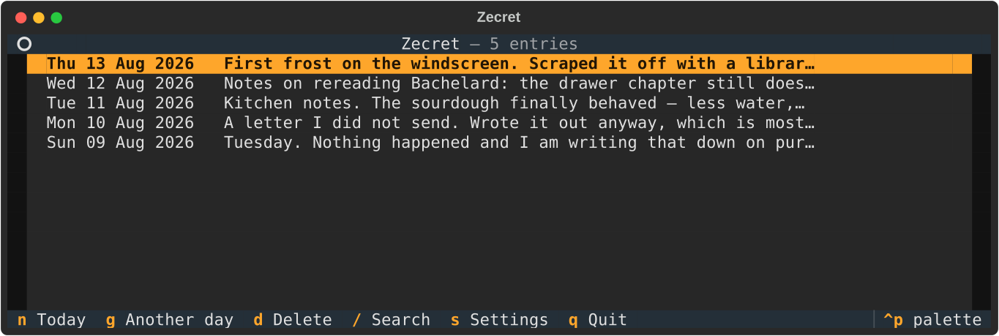
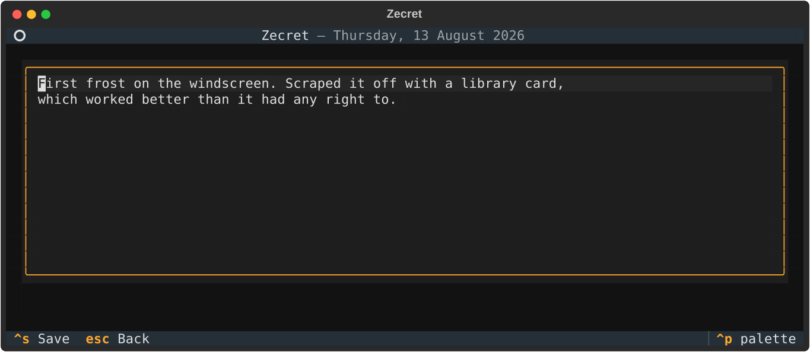
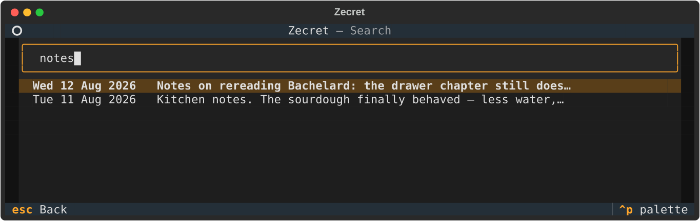

<div align="center">

# Zecret

**A modern, encrypted terminal diary.**

One entry a day, in your terminal, kept in a single encrypted file that only
you can open.

[](https://github.com/kfurtak1024/zecret/actions/workflows/ci.yml)
[](https://www.python.org)
[](LICENSE)
[](https://textual.textualize.io)
[](https://github.com/astral-sh/uv)
[](https://github.com/astral-sh/ruff)
[](https://mypy-lang.org)

<picture>
  <source media="(prefers-color-scheme: dark)" srcset="assets/entries-dark.png">
  <source media="(prefers-color-scheme: light)" srcset="assets/entries-light.png">
  
</picture>

</div>

---

## Why

A diary should be private by construction, not by promise. Zecret has no
server, no account, no sync and no telemetry — there is nowhere for your
writing to go. It is one encrypted file on your own disk, opened by a
password only you know, in a terminal you already have open.

- 📅 **One entry a day** — each day is a page, named by its date; come back and it is the same page
- 🔐 **Encrypted at rest** — Argon2id key derivation, AES-256-GCM per entry
- ✍️ **Keyboard-driven** — a fast Textual TUI, no mouse required
- 🔎 **Instant search** — live filtering across everything you have written
- 📄 **One portable file** — back it up by copying it; it is useless without your password
- 🌗 **Light and dark** — follows your terminal's theme
- 🚫 **Offline by design** — no networking of any kind

## Install

Zecret is managed with [uv](https://github.com/astral-sh/uv).

```bash
git clone https://github.com/kfurtak1024/zecret.git
cd zecret
uv sync
uv run zecret
```

To get a `zecret` command available from anywhere:

```bash
uv tool install .
zecret
```

Your diary lives at `~/.zecret/diary.enc` by default. Point somewhere else
with `--path /some/where.enc` or the `ZECRET_DIARY_PATH` environment
variable — handy for keeping separate diaries, or trying it out without
touching your real one.

On first launch there is no diary yet, so Zecret asks you to choose a
master password and creates one. Every launch after that asks for that
password to unlock it.

> [!WARNING]
> There is no password recovery, by design. Nobody — including you — can
> open the file without the password. Choose something you will not lose.

## Using it

<div align="center">
<picture>
  <source media="(prefers-color-scheme: dark)" srcset="assets/editor-dark.png">
  <source media="(prefers-color-scheme: light)" srcset="assets/editor-light.png">
  
</picture>
</div>

Press <kbd>n</kbd> to write about today, <kbd>ctrl</kbd>+<kbd>s</kbd> to
save. A day holds one entry, so pressing <kbd>n</kbd> again later opens what
you already wrote rather than starting a second page — the evening simply
continues the morning. Every save re-writes the diary file atomically, so
there is no draft state to lose track of.

<div align="center">
<picture>
  <source media="(prefers-color-scheme: dark)" srcset="assets/date-dark.png">
  <source media="(prefers-color-scheme: light)" srcset="assets/date-light.png">
  
</picture>
</div>

Missed a day? Press <kbd>g</kbd> and type the date. Anything up to today is
fair game; days that have not happened yet are refused.

<div align="center">
<picture>
  <source media="(prefers-color-scheme: dark)" srcset="assets/search-dark.png">
  <source media="(prefers-color-scheme: light)" srcset="assets/search-light.png">
  
</picture>
</div>

Press <kbd>/</kbd> to search. Your entries are already decrypted in memory
for the session, so filtering is instant and nothing touches the disk.

### Keys

| Key | Where | Does |
| --- | --- | --- |
| <kbd>n</kbd> | entry list | Write about today |
| <kbd>g</kbd> | entry list | Write about another day (asks which) |
| <kbd>enter</kbd> | entry list | Open the selected day |
| <kbd>d</kbd> | entry list | Delete the selected day's entry (asks first) |
| <kbd>/</kbd> | entry list | Search |
| <kbd>s</kbd> | entry list | Change your master password |
| <kbd>q</kbd> | entry list | Quit |
| <kbd>ctrl</kbd>+<kbd>s</kbd> | editor | Save and return |
| <kbd>esc</kbd> | anywhere | Back (asks first if you have unsaved edits) |

## How it works

- **Key derivation** — Argon2id (`time_cost=3`, `memory_cost=64 MiB`,
  `parallelism=4`, roughly OWASP interactive settings), with a random
  16-byte salt generated per diary and stored in the file header. Your
  password is never stored; the derived key never touches disk.
- **Encryption** — AES-256-GCM with a fresh random nonce for every
  encryption. Each day's entry is encrypted independently, so editing one
  day never re-encrypts the others. Only the dates are visible in the file;
  every word you write is inside the ciphertext.
- **Integrity** — tampering with a stored entry, or a wrong password, fails
  the AEAD authentication check and is reported as an error, never as an
  empty or partial diary. The header carries an encrypted verifier, so this
  holds even for a diary with no entries yet.
- **Durability** — saves are atomic (temp file → `fsync` → `os.replace`),
  so an interrupted write can never leave a half-written diary. The file is
  created `0600`.

Plaintext is never written to disk — not as temp files, not as logs, not
for crash recovery.

## Development

```bash
uv sync          # dev tools included (PEP 735 dependency group)
uv run pytest
uv run ruff check . && uv run ruff format .
uv run mypy
```

CI runs those same checks on every push and pull request. `uv.lock` is
committed and CI installs from it, so regenerate and commit it whenever
`pyproject.toml` changes.

Zecret targets Python 3.14 only, pinned in `.python-version`. It is an
application rather than a library, so there is no consumer whose own
version range it has to accommodate — and `uv` installs the right
interpreter for you regardless of what your system ships.

The layering is strict and worth preserving: `crypto.py` knows nothing
about entries or files, `models.py` knows nothing about encryption,
`storage.py` is the only module that touches the filesystem, and screens
reach the diary only through the app. See [CLAUDE.md](CLAUDE.md) for the
full architecture and the security requirements the test suite enforces.

## License

MIT.
